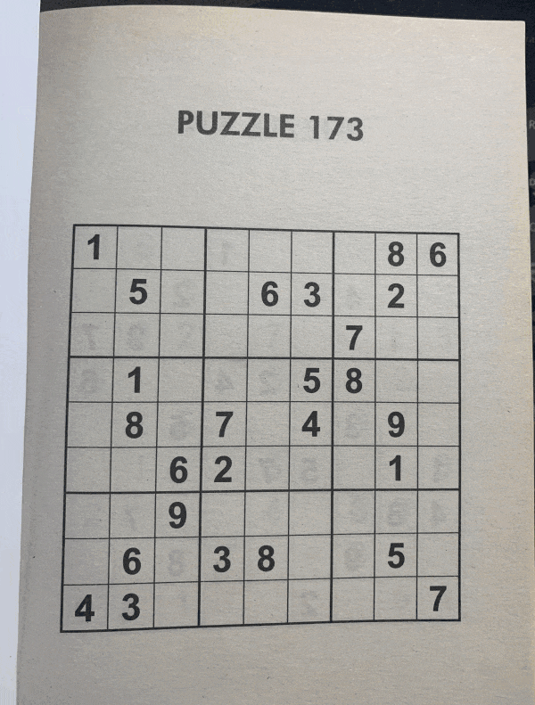

# Sudoku AI Solver

<p align='center'>
    
</p>

<!-- ## Docker container

The main Jupyter notebook, `sudoku_puzzle_extractor.ipynb`, and relevant files needed for this project can be run in a Docker container. 

First pull the image (with a compressed size of 1.93 GB) from the Docker Hub repository:
```
docker pull thenoobinventor/sudoku-ai-solver:latest
```

Then run a container (choose a name for it) based on the image:

```
docker run -it --rm -p 8890:8890 --name container_name thenoobinventor/sudoku-ai-solver:latest
```

The documentation for this project can be found [here](https://TheNoobInventor.github.io/sudoku-ai-solver/). -->


# Deep Sudoku Solver

## Overview

Welcome to the Deep Sudoku Solver project! This project is a deep learning-based approach to solving Sudoku puzzles. The goal is to create a robust and efficient solver that can handle a variety of Sudoku puzzles with different levels of difficulty.

## Features

- **Deep Learning Model:** The solver is powered by a deep neural network trained on a diverse dataset of Sudoku puzzles. The model has been fine-tuned to accurately predict the solution for a given puzzle.

- **Support for Various Puzzles:** Whether you have an easy 9x9 Sudoku puzzle or a more challenging variant, this solver aims to handle them all. The model is designed to adapt to different puzzle sizes and configurations.

- **User-Friendly Interface:** The project includes a user-friendly interface for inputting Sudoku puzzles and viewing the solutions. The interface is designed to be intuitive and accessible for users of all levels.

## Getting Started

### Prerequisites

- Python 3.x
- TensorFlow
- NumPy

### Installation

1. Clone the repository:

   ```bash
   git clone https://github.com/deep-sudoku-solver/deep-sudoku-solver.git
   cd deep-sudoku-solver
2. Install dependencies:

    ```bash
    pip install -r requirements.txt
3. Run the solver:

    ```bash
    python solve_sudoku.py


## Usage

1. Launch the solver using the provided script.
2. Input the Sudoku puzzle using the provided interface.
3. Let the deep learning model solve the puzzle.
4. View the solution and marvel at the solver's intelligence!

## Contributing

If you would like to contribute to the project:
- Open an issue or submit a pull request.
- Contributions are always welcome!

## License

This project is licensed under the MIT License - see the [LICENSE](LICENSE) file for details.

## Acknowledgments

Special thanks to the contributors and the open-source community for their valuable input and feedback.

Enjoy solving Sudoku puzzles with the power of deep learning!
